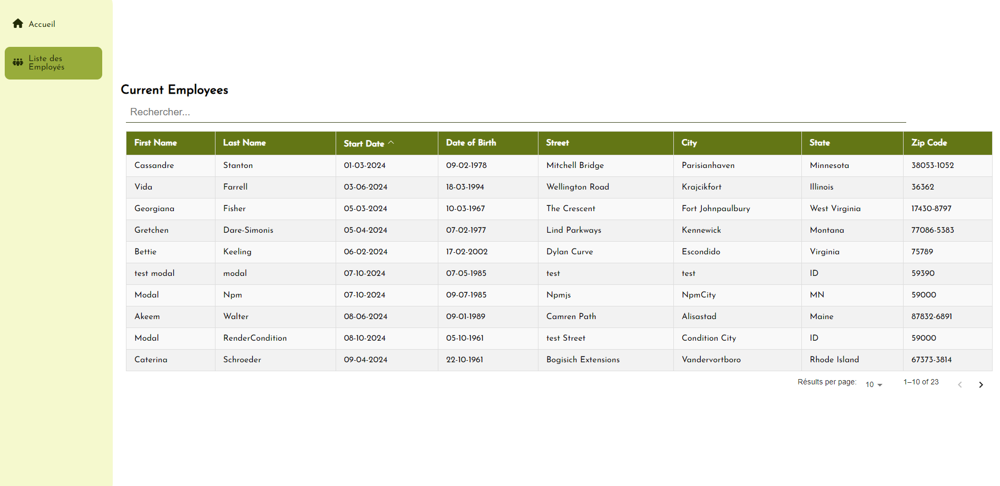

# Dashboard de gestion (React & Redux)

<a name="readme-top"></a>

<!-- PROJECT LOGO -->
<br />
<div align="center">
  <a href="">
    
  </a>
</div>

<!-- TABLE OF CONTENTS -->
<details>
  <summary>Table des matières</summary>
  <ol>
    <li><a href="#a-propos-du-projet">À propos du projet</a></li>
    <li><a href="#technologies-utilisees">Technologies utilisées</a></li>
    <li><a href="#installation">Installation</a></li>
    <li><a href="#utilisation">Utilisation</a></li>
    <li><a href="#tests-de-performance">Tests de performance</a></li>
    <li><a href="#contact">Contact</a></li>
  </ol>
</details>

<!-- ABOUT THE PROJECT -->
## À propos du projet

**HRNet** est un projet de modernisation réalisé pour **WealthHealth**, une grande société financière.

### Mission :
Le projet vise à convertir l'application interne HRNet de jQuery vers **React**. L'objectif principal est de refondre les pages clés de l'application, notamment les sélecteurs de date, les modales, les menus déroulants et les tableaux, en remplaçant les plugins jQuery par des composants React personnalisés. Cette migration est effectuée pour améliorer la performance de l'application et réduire les bugs récurrents.

### Tâches principales :
- **Conversion complète** de l'application **HRNet** en React.
- **Remplacement** de **jQuery** par des composants React pour les principaux éléments de l'interface utilisateur.
- **Analyse de performance** avant et après migration avec **Lighthouse**.
- **Documentation** détaillée du nouveau composant React créé, incluant un guide d'utilisation et des commentaires de code.




## Technologies utilisées

[](https://reactjs.org/)
[](https://redux.js.org/)
[](https://developers.google.com/web/tools/lighthouse)
[](https://vitejs.dev/)
[](https://github.com/faker-js/faker)

## Installation

### Étapes pour configurer le projet :

1. **Cloner le dépôt du projet** :
   ```bash
   git clone https://github.com/AurelieDuynslaeger/Wealth-Health-OCR-p14.git
   ```

2. **Installer les dépendances** :
   ```bash
   npm install
   ```

3. **Lancer l'application en mode développement** :
   ```bash
   npm run dev
   ```

4. **Serveur backend** : Utiliser le backend existant ou configurer une API appropriée pour l'application HRNet.

### Gestion des données

Il n'y a pas d'API ni de backend pour le moment. La gestion des données est effectuée localement à l'aide de **Redux** pour stocker l'état global de l'application et de **localStorage** pour persister les données entre les sessions. Pour simuler des données réalistes d'employés, j'ai utilisé **Faker.js**, générant des informations aléatoires à des fins de développement et de test.

## Utilisation

- Accédez à l'application en ouvrant `http://localhost:3000` dans votre navigateur.
- Utilisez l'interface pour gérer les dossiers des employés (création et consultation).
- Les composants clés tels que le sélecteur de date, la modale et le tableau ont été optimisés avec React.

## Tests de performance

Des tests de performance ont été effectués à l'aide de **Lighthouse** pour comparer les performances avant et après la migration de jQuery vers React.

### Résultats des tests :
- **Version jQuery** :
  - Temps de chargement initial : 3.2s
  - Score Lighthouse (Performance) : 72

- **Version React** :
  - Temps de chargement initial : 1.8s
  - Score Lighthouse (Performance) : 93

L'amélioration des performances résulte de la réduction de la manipulation excessive du DOM, de la gestion plus efficace des états avec Redux, et de l'élimination des lourdeurs liées à jQuery.
<!-- 


 -->

## Contact

Aurélie Duynslaeger - [LinkedIn](https://www.linkedin.com/in/ton-profil) - aurelie.duynslaeger@gmail.com

<p align="right">(<a href="#readme-top">retour en haut</a>)</p>
